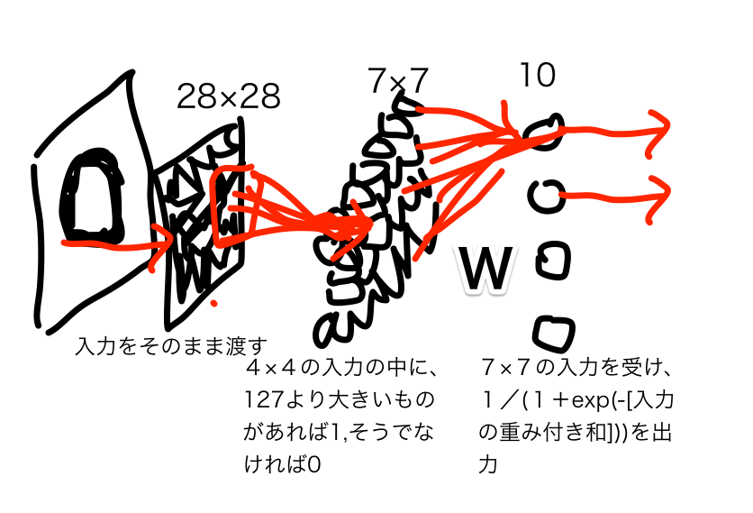

## 第1層 データマイニング手法からNeural Networkへ

この章では、読者が慣れ親しんだデータマイニング手法を、ニューラルネットワークに置き換えます。  
いきなりパーセプトロンがどうだよりはわかりやすかろうと。  

とりあえずKaggleの手書き文字認識をします。  
http://www.kaggle.com/c/digit-recognizer


## 1.1 Logistic Regression
### 普通の方法
データを読み込んで、trainからvalidデータ切り出して、モデルを10個作ります。  
つまり、0かそうでないかを判別するモデル、1かそうでないかを判別するモデル、・・・  

##### データ準備
まずはデータを読み込んで、使いやすい形に準備します。  

```
# setwd("/Users/KeiHarada/Documents/digit")

traindata <- read.csv("ORG/train.csv")
testdata <- read.csv("ORG/test.csv")
train_label <- traindata$label[1:28000]
valid_label <- traindata$label[28001:42000]

# transform into array
train_array <- array(as.matrix(traindata[1:28000,-1]),dim=c(28000,28,28))
valid_array <- array(as.matrix(traindata[28001:42000,-1]),dim=c(14000,28,28))

# check
# image(train_array[1,,])
# image(valid_array[1,,])
```

Arrayに変換しているのは半分趣味です。  
image(行列)で画像っぽくPlotに出力されます。適宜チェックしてください。  

##### データの圧縮
次に、28×28を説明変数にすると多すぎる気がするので、7×7に減らします。  
ついでにバイナリ(0/1)にしちゃいましょう。  
4×4の大きさのブロックに分割し(7×7個できます)、各ブロックの中に127より大きな値があれば1を、
そうでなければ0を出力とします。  

```
# resize(7*7)
# use max here
train_array_49 <- array(0,dim=c(28000,7,7))
for (i in seq(7)){
  for (j in seq(7)){
    for (row in seq(28000)){
      train_array_49[row,i,j] <- ifelse(max(train_array[row,((4*i-3):(4*i)),((4*j-3):(4*j))]) > 127,1,0)
    }
  }
}

# check
# image(train_array_49[1,,])
# image(train_array_49[2,,])
```

##### モデル構築
Rのデータフレームに変換して、glmで作ります。

```
train49 <- as.data.frame(cbind(train_label,array(train_array_49,dim=c(28000,49))))
# check
# image(matrix(as.numeric(train49[1,-1]),ncol=7))
# image(matrix(as.numeric(train49[2,-1]),ncol=7))


# logistic regression
logit0 <- glm((train_label==0)~.,data=train49)
logit1 <- glm((train_label==1)~.,data=train49)
logit2 <- glm((train_label==2)~.,data=train49)
logit3 <- glm((train_label==3)~.,data=train49)
logit4 <- glm((train_label==4)~.,data=train49)
logit5 <- glm((train_label==5)~.,data=train49)
logit6 <- glm((train_label==6)~.,data=train49)
logit7 <- glm((train_label==7)~.,data=train49)
logit8 <- glm((train_label==8)~.,data=train49)
logit9 <- glm((train_label==9)~.,data=train49)
```

10個のモデルができました。最も大きな確率を返したものが、このモデル(群)としての出力とします。  
ちょっと精度を見てみましょう。  
ここでは誤分類率が低ければよしとします。(モデル構築時は対数尤度ですが)  

```
# fit
trainfit <- data.frame(
  p0 = 1 / (1 + exp(-1*predict(logit0,data=train49))),
  p1 = 1 / (1 + exp(-1*predict(logit1,data=train49))),
  p2 = 1 / (1 + exp(-1*predict(logit2,data=train49))),
  p3 = 1 / (1 + exp(-1*predict(logit3,data=train49))),
  p4 = 1 / (1 + exp(-1*predict(logit4,data=train49))),
  p5 = 1 / (1 + exp(-1*predict(logit5,data=train49))),
  p6 = 1 / (1 + exp(-1*predict(logit6,data=train49))),
  p7 = 1 / (1 + exp(-1*predict(logit7,data=train49))),
  p8 = 1 / (1 + exp(-1*predict(logit8,data=train49))),
  p9 = 1 / (1 + exp(-1*predict(logit9,data=train49)))
)


trainres <- max.col(as.matrix(trainfit)) - 1

# confusion matrix
table(trainres,train_label)

# Categorization Accuracy
mean(trainres == train_label)
```
うん、まあまあの精度ですね。  


### ニューラルネットワークっぽくする
今のモデルをニューラルネットワークっぽく作りましょう。  

##### ネットワークの構成


##### 数学的な整理
とりあえず、7×7のニューロンに番号をつけて、
その出力を$x_1, x_2, \dots, x_{49}$とします。  
その次にある10個のニューロンにも番号をつけて(1番目のニューロンが0かそうでないかを判別するとして)、その出力を$y_1, y_2, \dots, y_{10}$とします。このとき、  
\\[
y_j = \sigma(\sum_{i=1}^{49} w_{ij}x_i+c_j)
\\]
となります。ここで、  
* $w_{ij}$はj番目のニューロンがi番目のニューロンにつける重みです。  
* $c_j$はj番目のニューロンが常に1を出力するニューロンにつける重みです。  
* $\sigma$はシグモイド関数$\sigma(Z)=1 / (1 + \exp(-Z))$です。  

$w_{ij}$と$c_j$の最適化をすると、さきほどのロジスティック回帰と同値になることがおわかりいただけるでしょうか。  

##### 重みの最適化


```
train49_mat <- cbind(train_label,array(train_array_49,dim=c(28000,49)))
# check
# image(matrix(train49_mat[1,-1],ncol=7))
# image(matrix(train49_mat[2,-1],ncol=7))

# answers
answer_mat <- matrix(0,nrow=28000,ncol=10)
for (i in seq(10)){
  answer_mat[train49_mat[,1]==(i-1),i] <- 1
}


# learn weights
W <- matrix(0.0,nrow=10,ncol=49)
intercept <- rep(0.0,length=10)

# learn rate
eta <- 0.001

for (i in seq(28000)){
  # feed forward
  output <- 1 / (1 + exp(-1*(W %*% train49_mat[i,-1] + intercept)))

  # back propagation
  W <- W + eta * (answer_mat[i,] - output) %*% t(train49_mat[i,-1])
  intercept <- intercept + eta * (answer_mat[i,] - output)
  
}

output_mat <- 1 / (1 + exp(-1*(train49_mat[,-1] %*% t(W) + matrix(1,nrow=28000,ncol=1) %*% matrix(intercept,ncol=10))))

trainres <- max.col(as.matrix(output_mat)) - 1
table(trainres,train_label)
mean(trainres == train_label)
```
